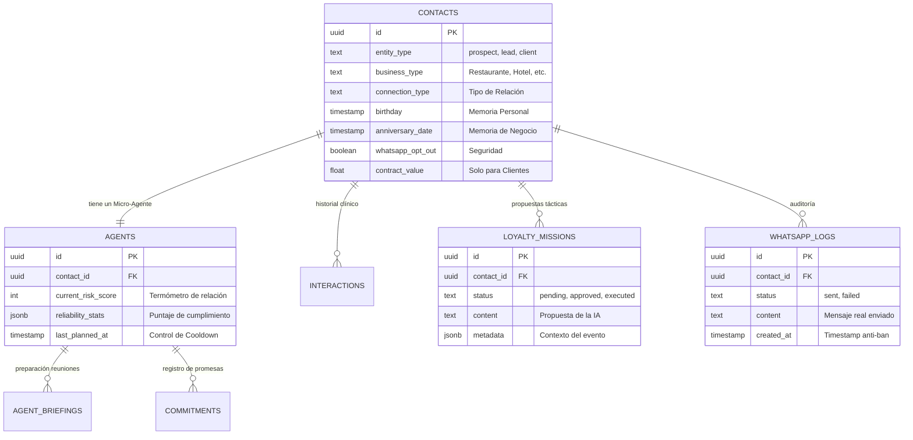

# Modelo de Datos: Donna & CRM Estratégico

Este documento detalla la estructura y relaciones de las entidades que alimentan el cerebro de Donna.

## Diagrama de Relaciones (Donna Core)

## Descripción de Tablas Clave

### 1. `contacts` (El Sujeto)
Es la tabla maestra. Donna lee esta tabla no solo para saber quién es el cliente, sino para detectar **eventos gatillo** (cumpleaños, aniversarios o cambios de ciudad).

### 2. `agents` (Donna Micro)
Es el "perfil psicológico" del cliente. Aquí es donde Donna guarda qué tan confiable es el cliente (sus promesas cumplidas vs rotas) y cuándo fue la última vez que se le realizó un análisis profundo (`last_planned_at`).

### 3. `interactions` (La Memoria)
Es la fuente de la **Resiliencia de Memoria**. Donna lee las últimas 10 entradas de aquí para entender el contexto actual y no confundirse con información vieja (Timeline Paradox).

### 4. `loyalty_missions` (La Acción)
Aquí viven las misiones sugeridas. Una misión no se envía hasta que un humano (César o Abel) la aprueba en el módulo de Donna.

### 5. `whatsapp_logs` (Seguridad)
Es el libro de auditoría. Centraliza todo lo enviado para garantizar que sigamos las reglas anti-ban (ventanas de tiempo y límites de velocidad).

---

> [!TIP]
> **Donna Macro** escanea todas estas tablas en conjunto para generar reportes estratégicos, mientras que **Donna Micro** se enfoca exclusivamente en un ID de `contact_id` a la vez.
