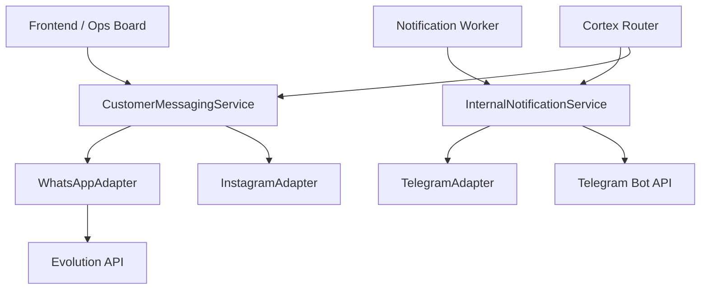

# 🏆 MASTER CONTEXT: CRM OBJETIVO V2

Este es el documento de **Transferencia de Conocimiento y Reglas Críticas**. Debe ser la **primera lectura obligatoria** para cualquier sesión de IA (Antigravity) que inicie en este repositorio.

---

## 📋 1. ESTADO ACTUAL DEL PROYECTO (Feb 2026)

### Hitos Alcanzados:
- **Refactorización Modular (Stage 2)**: El sistema de mensajería ha sido desacoplado. Ahora existen servicios especializados (`InternalNotificationService` y `CustomerMessagingService`) que separan la comunicación con el equipo (Telegram) de la comunicación con clientes (WhatsApp/Instagram).
- **Visibilidad WhatsApp**: Se corrigió el error de "mensajes fantasmas" mediante la optimización de queries con `DISTINCT ON` y la corrección de etiquetas de plataforma en la base de datos.
- **Consola de Operaciones 360°**: Se ha validado la arquitectura del módulo `/ops` como el estándar de oro para la interfaz omnicanal unificada.

### Componentes Críticos del Código:
- **`lib/donna/services/CortexRouterService.ts`**: El cerebro que interpreta intenciones. Ahora delegado para el envío.
- **`lib/messaging/services/`**: Contiene la lógica modular de envío (Interno vs Cliente).
- **`scripts/notification_worker.ts`**: Procesador de recordatorios y alertas de planificación.
- **`components/ops/`**: Frontend de alta densidad para gestión omnicanal.

---

## 🧠 2. REGLAS MAESTRAS (MUST-FOLLOW)

### Arquitectura de Datos:
1. **Unificación de Contactos**: La tabla `contacts` es la única fuente de verdad para Leads y Clientes. `discovery_leads` solo para investigación previa.
2. **Ghost ID**: Siempre vincular `discovery_lead_id` en `contacts` para no perder el historial de investigación fría.
3. **Omnicanalidad**: Usar `contact_channels` para mapear múltiples IDs (WhatsApp, Telegram, IG) a un mismo contacto.

### Desarrollo y Estética:
1. **High-Fidelity UI**: El usuario exige diseños tipo "Wow", con aesthetics modernos (Dark mode, glassmorphism, micro-animaciones). Ver `/ops` para referencia de densidad.
2. **DRY & Lean**: Prohibido el copy-paste. Lógica compartida debe ir a `components/shared/sales`.
3. **Ecuador Timezone**: Operar estrictamente bajo `America/Guayaquil` (UTC-5). Todo cálculo de fecha y hora debe usar `date-fns-tz`.

### Comportamiento Donna:
1. **Psicología "Closer"**: Donna es ejecutiva, asertiva y resolutiva. No pide permiso, propone soluciones.
2. **Aprobación Humana**: Donna propone -> César aprueba (Telegram/UI) -> Donna ejecuta (WhatsApp).
3. **Pausa Automática**: Ante ambigüedad, pausar bot (`botMode: paused`) y alertar a César.

---

## 🏗️ 3. ARQUITECTURA DE MENSAJERÍA (MODULAR)

---

## 🎯 4. TAREAS PENDIENTES Y VISIÓN V3

- [ ] **Migración Completa a `contacts`**: Mover datos residuales de tablas legadas.
- [ ] **Handler Pattern en Cortex**: Dividir el switch masivo de `routeToTable` en Handlers independientes.
- [ ] **Humanizer Middleware**: Centralizar la lógica de fragmentación y delay de mensajes.
- [ ] **Integración de Estrategias IA**: Conectar el generador de estrategias de `/ops` con el `TrainerEngine`.

---

## 📂 5. ARCHIVOS DE REFERENCIA CRÍTICA
- `docs/REENGINEERING_STRATEGY.md`: Visión técnica a largo plazo.
- `CRM_MASTER_RULES.md`: Reglas de negocio e infraestructura.
- `lib/donna/prompts/`: Definición de la personalidad y flujos de Donna.

**Firmado por: Antigravity (IA Assistant)**
*Última actualización: 6 de Febrero, 2026*
