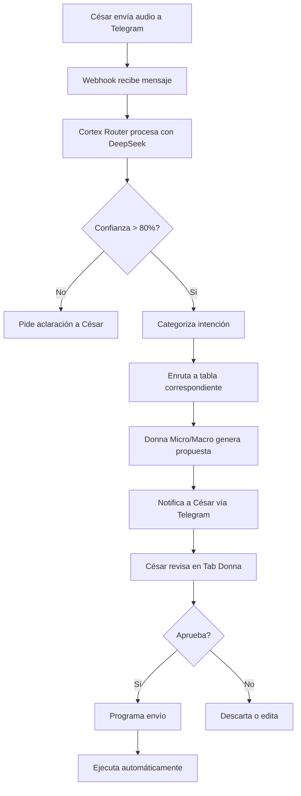

# ARQUITECTURA DONNA: SISTEMA DUAL DE FIDELIZACIÓN

Este documento describe la arquitectura completa del Sistema de Fidelización IA Dual implementado en CRM OBJETIVO.

## VISIÓN GENERAL

Donna es un sistema de inteligencia artificial dual que gestiona la fidelización de clientes a través de dos niveles complementarios:

- **Donna_Agente (IA Micro):** Memoria relacional 1:1 por cliente
- **Donna Estratégica (IA Macro):** Inteligencia colectiva sobre toda la base de datos

## COMPONENTES PRINCIPALES

### 1. Cortex Router (Enrutador de Inteligencia)
**Ubicación:** `lib/donna/services/CortexRouterService.ts`  
**Función:** Procesa audios y notas de Telegram, categorizándolos en:
- Tareas operativas
- Datos de memoria (fidelización)
- Compromisos
- Notas estratégicas

**Modelo:** DeepSeek Reasoner (con fallback a Gemini 2.0 Think)

### 2. Sistema de Prompts Desacoplados
**Ubicación:** `lib/donna/prompts/`  
**Archivos:**
- `cortex_router.md` - Prompt madre del enrutador
- (Futuros prompts de Micro y Macro)

**Ventaja:** Permite ajustar la "personalidad" de Donna sin tocar código.

### 3. Base de Datos

#### Tabla: `loyalty_missions`
Almacena las propuestas de fidelización generadas por Donna.

| Campo | Tipo | Descripción |
|-------|------|-------------|
| `id` | UUID | Identificador único |
| `source` | ENUM | 'micro' o 'macro' |
| `status` | ENUM | pending, approved, scheduled, executed, cancelled |
| `planned_at` | TIMESTAMP | Fecha programada de envío |
| `contact_id` | UUID | Cliente afectado (para Micro) |
| `content` | TEXT | Mensaje generado |
| `metadata` | JSONB | Razón de la propuesta |

#### Tabla: `agents` (Extendida)
- `experiential_memory` (JSONB): Hobbies, familia, hitos
- `emotional_profile` (JSONB): Tono preferido, frecuencia ideal

### 4. Flujo de Trabajo

## INTEGRACIÓN TELEGRAM

**Bot:** `@cesarobjetivo_bot`  
**Webhook:** `/api/telegram/webhook`  
**Flujo:**
1. César envía audio/nota al bot
2. Telegram llama al webhook
3. Se transcribe (si es audio)
4. Cortex Router procesa
5. Se almacena en BD
6. Donna genera propuestas

## PRÓXIMOS PASOS

- [ ] Implementar transcripción de audios (Whisper API)
- [ ] Desarrollar UI: Tab Donna - Misiones de Fidelización
- [ ] Implementar lógica de Donna Estratégica (Macro)
- [ ] Implementar lógica de Agente_Donna (Micro)
- [ ] Sistema de notificaciones proactivas

---

**Última actualización:** 2025-12-26  
**Versión:** 1.0
