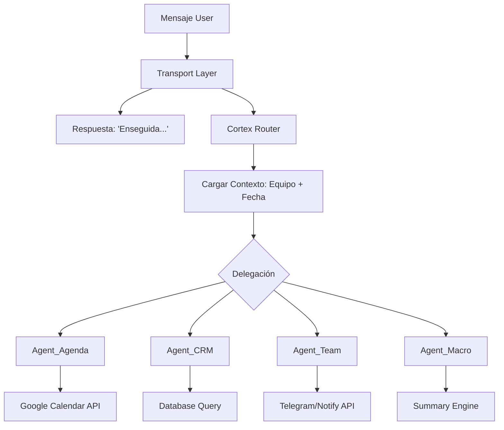

# 🤖 DONNA SENIOR ARCHITECTURE v3.0

Esta es la arquitectura definitiva para Donna, diseñada bajo principios de **Senior Engineering**: modularidad, delegación clara y separación de transporte.

---

## 1. Capas de Operación

### Capa 0: Transporte (Omnicanal)
Donna no depende de Telegram. Recibe un `DonnaInput`:
- **Fuentes:** Telegram, WhatsApp (Evolution API), Dashboard Web (Test Room).
- **Tipos:** Texto plano o Audio (transcrito por Whisper).
- **ACK Inmediato:** El transporte responde "Enseguida lo reviso..." antes de invocar al cerebro.

### Capa 1: El Orquestador (Cortex Router)
Es el único que recibe el input original. Su única misión es:
1. **Contextualizar:** Leer identidad (César, Abel, Mayra) y fecha/hora actual (Ecuador).
2. **Clasificar:** Decidir qué "Especialista" necesita.
3. **Delegar:** Pasar el mando al agente correspondiente.

### Capa 2: Agentes Especialistas (Workers)
Cada agente tiene sus propias herramientas (Tools) y acceso a DB:
- **Donna_Agenda:** `CalendarService` + `Google Calendar API`.
- **Donna_Clientes:** `contacts`, `discovery`, `interactions`. Responde "¿Quién es X?", "¿Qué hablamos ayer?".
- **Donna_Equipo:** Directorio interno. Sabe quién es Abel, Mayra (contadora), Alvarito (hosting).
- **Donna_Macro:** Reportes, KPIs y planificación de "Goteo".

---

## 2. El "Perfil Donna" (La Identidad)
Donna ya no es un bot genérico. Su prompt base incluye:
- **Quién es:** "Gerente de Operaciones de Objetivo".
- **A quién sirve:** César Reyes (CEO).
- **Su equipo:** 
    - Abel (Seguimiento comercial).
    - Mayra (Contabilidad y Administrativo).
    - Alvarito (Aliado tecnológico, Digitalmedia).
- **Tono:** Ejecutivo, asertivo, resolutivo. No pide permiso, propone soluciones.

---

## 3. Flujo de Datos Senior

## 4. Unificación de Prompts
Se eliminarán los prompts redundantes. El esquema será:
- `lib/donna/prompts/core_identity.md`: Quien es Donna y el equipo.
- `lib/donna/prompts/router.md`: Solo para delegación.
- `lib/donna/prompts/workers/`: Un archivo por especialista.

## 5. Casos de Uso
1. **"Dona agendame con Abel el lunes":** Router detecta Agenda + Entidad (Abel). Delega a Agenda.
2. **"Dona quien es Alvarito":** Router detecta Equipo. Delega a Team Agent.
3. **"Dona como va la investigacion de Hotel X":** Router detecta Clientes. Delega a CRM Agent.
